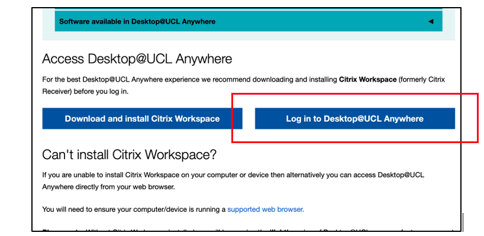
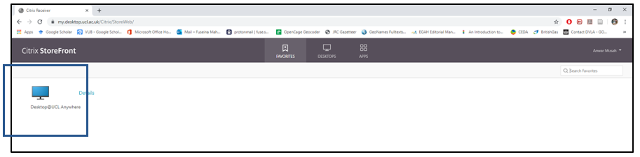
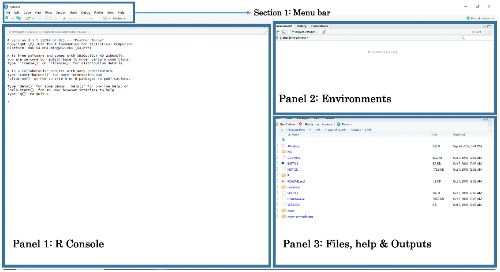
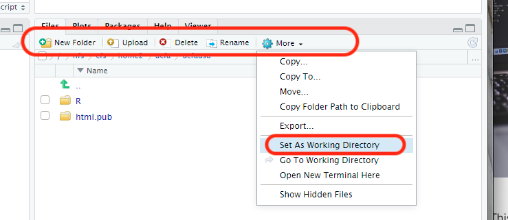

# Understanding Data

## Introduction

Welcome to week 1's practicals for Introduction to Quantitative Research Methods. This week we will focus on understanding data. The goal for this week’s session is to get you started with using RStudio and getting you to become familiar with its environment. Today's session aims to introduce you to the basic programming etiquette as well as building your confidence in using RStudio. At the end of this session, you should be able to perform the following:

1. Accessing RStudio Server from a UCL Workstation or remotely
2. Use the R-Console as a basic calculator
3. Loading in data from a CSV & sub-setting it into smaller chunks
4. Handle discrete and categorical data
5. Basic graphical visualisation in RStudio

Make sure to download the data set for Week 1 from [**Moodle**](https://moodle.ucl.ac.uk/), as we will use it later on in **Section 1.7.**.

At the end of this tutorial, you will be asked to complete the tasks and questions in **Section 1.9**. Do try to complete this before Thursday's live face-to-face seminar session. The solutions to **Section 1.9** will be released of [**Moodle**](https://moodle.ucl.ac.uk/) on Thursday's after 1:00pm 

### Reading list

Please find the reading list for this week below. We strongly recommend that you read the core reading material before you continue with the rest of this week’s material.

- Cetinkaya-Rundel, M., and Hardin, J., 2021, **Introduction to Modern Statistics**, Section I: Introduction to data, Chapter 1: Hello data, Page(s): 12-22. Source: [**openintro.org/book/ims**](https://openintro.org/book/ims).

To download the full book, click on this link: [**https://openintro-ims.netlify.app**](https://openintro-ims.netlify.app), Then make sure to click following: "**Download PDF**" >> "**Read Free Sample**" >> "**PDF**"   

### Q & A session

This week there will be a live Q&A session on **Tuesday, January 11, 2022 @ 11h00 to 12:30 (GMT)**. The session will be hosted on Zoom [**LINK**](https://ucl.zoom.us/j/96460973152?pwd=K2taYWJLdm5HKzAzQXJCUThxbUczUT09). For security reasons, the meeting password for this Q&A session can be found on Moodle on the main page: **POLS0008 Online Q&A - Tuesdays 11:00-12:30**

## Instructions for accessing RStudio on UCL Server 

<div class="note">
**Important Note**: You are strongly advised to use RStudio via UCL Server. This version is currently only available on the UCL network, or through VPN or **Desktop @ UCL Anywhere**. If you are not working on a UCL Workstation, use you own personal device (e.g. desktop, laptop, tablet, smartphone, etc) to connect remotely with **Desktop @ UCL Anywhere** first before proceeding to use RStudio through a UCL server via a web browser.
</div>
<br>
**OPTION A - Connecting directly on UCL Workstation**: To begin, we provide a step-by-step guide to accessing RStudio Server via a UCL workstation. Open a web browser (i.e., Internet Explorer or Google Chrome) and navigate to: [**https://rstudio.data-science.rc.ucl.ac.uk/**](https://rstudio.data-science.rc.ucl.ac.uk/). Log in with your usual UCL **username** and **password**. You should see the RStudio interface appear. 

**Video explanation (Length: 4:03 minutes)**
```{r, warnings=FALSE, message=FALSE, echo=FALSE}
library(vembedr)
embed_msstream('2924b6c0-8efc-47e0-8fdd-d8070ebd8f4c') %>% use_align('left')
```

**OPTION B - Connecting from a personal device**: Alternatively, if you are working from you **personal computer**, you can access RStudio via UCL Server. However, you will need to first log into a UCL workstation remotely via **Desktop @ UCL Anywhere** from your personal device. 

**Video explanation (Length: 12:03 minutes)**
```{r, warnings=FALSE, message=FALSE, echo=FALSE}
library(vembedr)
embed_msstream('1f6afc55-dcdd-4707-bfd9-135f168d9fd9') %>% use_align('left')
```

Here are the following steps:

Step 1. Initiate UCL Remote **Desktop @ Anywhere**, click on this [**LINK**](https://www.ucl.ac.uk/isd/services/computers/remote-access/desktopucl-anywhere)

```{r echo=FALSE, out.width = "100%", fig.align='center', cache=TRUE,}
 
```

Step 2. Next, click on the ‘**Log in to Desktop @ UCL Anywhere**’ blue button to log in, and then select “**Use Light Version**”.

```{r echo=FALSE, out.width = "100%", fig.align='center', cache=TRUE,}
 
```

Step 3. A page will appear asking you to enter your UCL **username** and **password**, enter these pieces of information, and click “**Log On**”.

```{r echo=FALSE, out.width = "100%", fig.align='center', cache=TRUE,}
 
```

Step 4. Click on the icon “**Desktop @ UCL Anywhere**” to initiate the remote access on to a UCL workstation

Step 5. You are now working on a UCL workstation remotely. To open RStudio on server simply open any web browser (i.e., Internet Explorer or Google Chrome) and navigate to: [**https://rstudio.data-science.rc.ucl.ac.uk/**](https://rstudio.data-science.rc.ucl.ac.uk/). Log in with your usual UCL **username** and **password** and you should see the RStudio interface appear.

## The environment in RStudio

When opening RStudio for the first time, you are greeted with its interface. The window is split into three panels: 1.) R-Console, 2.) Environments and 3.) Files, help & Output.

```{r echo=FALSE, out.width = "100%", fig.align='center', cache=TRUE,}
 
```

**Panel 1**: The R-Console lets the user type in R-codes to execute rapid commands and use it as basic calculator.

**Panel 2**: The Environments lets the user see which data sets, objects and other files are currently stored in RStudio’s memory

**Panel 3**: Under the File tab, it lets the user access other folders stored in the computer to open datasets. Under the Help tab, it also allows the user to view the help menu for codes and commands. Finally, under the Plots tab, the user can perusal his/her generated plots (e.g., histogram, scatter plots, maps etc.).

The above section is the Menu Bar. You can access other functions for saving, editing, and opening a new Script File for writing codes. When you open a **Script File**, it reveals a fourth panel above the R-Console.

You can open a Script File by simply going to the Menu Bar and clicking on "**New File**" >> "**R Script**". This should open a new Script File titled 'Untitled 1'.

In all practical tutorials, you will be encouraged to use an R Script for collating and saving the codes written for these analyses. We will start writing codes in a script from **section 1.7** on wards. For now, let us start with the absolute basics, we begin with interacting with the R-Console as a basic calculator and typing in some simple code.

## Using the R-Console as a calculator

The R console window (i.e., Panel 1) is the place where RStudio is waiting for you to tell it what to do. It will show the code you have commanded RStudio to execute, and it will also show the results from that command. You can type the commands directly into the window for execution of as well.

**Video explanation (Length: 13:34 minutes)**
```{r, warnings=FALSE, message=FALSE, echo=FALSE}
library(vembedr)
embed_msstream('acb452dd-7d4e-46b6-9bcd-ce437cd1a8b2') %>% use_align('left')
```

Let us start by using the console window as a basic calculator for typing in addition (`+`), subtraction (`-`), multiplication (`*`), division (`/`) and performing other complex sums. Click inside the R Console window and type `19+8`, and press enter button to get your answer. 

Perform the following sums by typing them inside the R Console window:

```{r}
# Addition
19+8
# Subtraction
20-89
# Multiplication
18*20
# Division
27/3
# Complex sums
(5*(170-3.405)/91)+1002
```

<div class="note">
**Important Note**: To write a comment, you can use a hash-tag `#` followed by text e.g., `# Using it a calculator`, RStudio will treat this as a comment and not as a code.
</div>

Aside from basic arithmetic operations, we can use some basic mathematical functions such as the exponential and natural logarithms: 

- `exp()` is the exponential function

- `log()` is the logarithmic function

- `^` this symbol allows the user to raise a number to a power

Do not worry at all about these function as you will use them later in the weeks to come for transforming variables. For now, perform the following by typing them inside the R-Console window:

```{r}
# Exponential
exp(5)
# Natural logarithm
log(3)
# Raising a number to a power e.g., 2 raise to the power of 8
2^8
```


## Creating basic objects and assigning values to them

Now that we are a bit familiar with using the console as a calculator. Let us build on this and learn one of the most important codes in RStudio which is Assignment Operator.

**Video explanation (Length: 20:28 minutes)**
```{r, warnings=FALSE, message=FALSE, echo=FALSE}
library(vembedr)
embed_msstream('a71574d3-8cbd-49f6-92ea-dfe4fcdfeae8') %>% use_align('left')
```

This arrow symbol `<-` is called the Assignment Operator. It is typed by pressing the less than symbol `<` followed by the hyphen symbol `-`. It allows the user to assign values to an object.

Objects are defined as stored quantities in RStudio's environment. These objects can be assigned anything from a numeric value to a string character. For instance, suppose we want to create a numeric object called `x` and assign it with a value of `3`. We do this by typing `x <- 3`. Another example, suppose we want to create a string object called `y` and we assign it with some text `"Hello!"`. We do this typing `y <- "Hello!"`.

Let us create the objects `a`, `b`, `c`, and `d` and assign them with numeric values. Perform the following by typing them inside the R Console window:

```{r}
# Create an object called 'a' and assign the value 17 to it
a <- 17

# Type the object 'a' in console as a command to return value 17
a

# Create an object called 'b' and assign the value 10 to it
b <- 10

# Type the object 'b' in console as a command to return value 10
b

# Create an object called 'c' and assign the value 9 to it
c <- 9

# Type the object 'c' in console as a command to return value 9
c

# Create an object called 'd' and assign the value 8 to it
d <- 8

# Type the object 'd' in console as a command to return value 8
d
```

Notice how the objects `a`, `b`, `c` and `d` and its value are stored in RStudio's environment panel. We can perform the following arithmetic operations with these object values:

```{r}
# Use the objects a, b, c & d to type the following maths
(a + b + c + d)/5
# Use the objects a, b, c & d to type the following maths
(5*(a-c)/d)^2
```

Let us create more objects but this time we will assign character string(s) to them. Please note that when typing a string of characters as data in RStudio, you will need to cover them with quotation marks "...". For example, suppose we want to create a string object called `y` and assign it with some text `"Hello!"`. We do this by typing `y <- "Hello!"`.

Try these examples of assigning the following character text to an object.

```{r}
# Create an object called 'e' and assign the character string "RStudio"
e <- "RStudio"

# Type the object 'e' in the console as a command to return "RStudio"
e

# Create an object called 'f', assign character string "Hello world" 
f <- "Hello world"

# Type the object 'f' in the console as a command to return "Hello world"
f

# Create an object called 'g' and assign "Blade Runner is amazing"
g <- "Blade Runner is amazing"

# Type the object 'g' in the console to return the result
g
```

We are now familiar with using the console and assigning (numeric and string) values to objects. The parts covered in from section 1.3 and 1.4 are the initial building blocks for coding & creating data sets. 

Let us progress to section 1.5. From this point onwards, we will learn the basics of managing data and etiquettes, which includes creating data frames, as well as importing CSVs & saving R-objects as a CSV file, and setting up a work directory in RStudio server.

## Data entry in RStudio

As you have already seen, RStudio is an object-oriented software package and so entering data is slightly different for the usual way when inputting information into a spreadsheet (e.g., Microsoft Excel etc.,). Here, you will need to enter the information as **Vector** objects before combining them into a **Data Frame** object.

Consider this incredibly **_Wishie Washy_** example of some data containing additional health information of 10 people. It contains the variable (or column) names `'id'`, `'name'`, `'height'`, `'weight'` and `'gender'`.

<br>

**id** | **name**|**height**|**weight**|**gender**
------ | --------| --------| --------| --------
1| Sam | 1.65 | 64.2 | M
2| Kofi | 1.77 | 80.3 | M
3| Kate | 1.70 | 58.7 | F
4| Cindy | 1.68 | 75.0 | F
5| Patel | 1.80 | 69.6 | M
6| James | 1.60 | 49.3 | M
7| Tatiana | 1.66 | 52.7 | F
8| Roberto | 1.71 | 40.0 | M
9| Rubio | 1.63 | 55.6 | M
10| Fatima | 1.73 | 62.5 | F

<br>

In RStudio, data is entered as a sequence of elements and listed inside an object called a **Vector**. For instance, if we have three age values of 12, 57 and 26 years, and we want to enter this in RStudio,  we need to use the function `c()` and combine these three elements into a **Vector** object. 

Hence, the code will be `c(12, 57, 26)`. We can assign this to something by typing this code `age <- c(12, 57, 26)`. Any time you type `age` into RStudio console. It will return these three values unless you chose to overwrite it with different information.

Let us look at this more closely with the `id` variable from the above data. Each person has an ID number from 1 to 10. We are going to list the numbers 1, 2, 3, 4, 5, 6, 7, 8, 9 and 10 as a sequence of elements into a vector using `c()` and then assign it to as a vector object calling it `id`.

```{r}
# Create 'id' vector object 
id <- c(1, 2, 3, 4, 5, 6, 7, 8, 9, 10)

# Type the vector object 'id' in console to return output
id
```

Now, let us enter the same remaining columns for `'name'`, `'height'`, `'weight'` and `'gender'` like we did for ‘id’:

```{r}
# Create 'name' vector object
name <- c("Sam", "Kofi", "Kate", "Cindy", "Patel", "Harry", "Kimba", "Roberto", "Rubio", "Fatima")

# Create 'height' (in meters) vector object
height <- c(1.65, 1.77, 1.70, 1.68, 1.80, 1.60, 1.66, 1.71, 1.63, 1.73)

# Create 'weight' (in kg) vector object
weight <- c(64.2, 80.3, 58.7, 75.0, 69.6, 49.3, 52.7, 40.0, 55.6, 62.5)

# Create 'gender' vector object
gender <- c("M", "M", "F", "F", "M", "M", "F", "M", "M", "F")
```

Now, that we have the vector objects ready. We can bring them together to create a proper data set. This new object is called a **Data Frame**. We need to list the vectors inside the `data.frame()` function.

```{r}
# Create a dataset (data frame)
dataset <- data.frame(id, name, height, weight, gender)

# Type the data frame object 'dataset' in console to see output
dataset
```

<div class="note">
**Important Note**: The column 'id' is numeric variable with integers. The second column 'name' is a text variable with strings. The third & fourth columns 'height' and ‘weight’ are examples of a numeric variables with real numbers – both variables are **continuous**. The variable 'gender' is text variable with strings – however, this type of variable is classed as a **categorical** variable as individuals were categorised as either 'M' and 'F'.
</div>

## Importing data into RStudio

We are going to import the downloaded data for Week 1 into RStudio. It contains information pertained to 58 primary schools in Ealing. We can open spreadsheets, particularly, CSV files in an organised way by uploading the file in the RStudio Server and then opening it using the `read.csv()` function. 

**Video explanation (Length: 12:15 minutes)**
```{r, warnings=FALSE, message=FALSE, echo=FALSE}
library(vembedr)
embed_msstream('e7abb9d1-290e-4e50-b470-9710e0bf9384') %>% use_align('left')
```

We can do this in four steps:

```{r echo=FALSE, out.width = "100%", fig.align='center', cache=TRUE,}
 
```

Step 1. Keep the space in your personal directory `/nfs/cfs/home2/XXXX/ucl_username` tidy by creating new folder and naming it `Week 1` simply by clicking the `New Folder` button in the bottom-right panel.

Step 2. Next, click on the `Week 1` folder to enter it, and then click on the `Upload` button and select the downloaded CSV file `Primary Schools in Ealing.csv` to be uploaded into the RStudio Server. 

Step 3. We must set the directory to the folder location in the server to where the CSV file was uploaded by clicking on the `More` >> `Set As Working Directory`.

Step 4. Finally, we can import the data using the `read.csv()` function. The code syntax in the script should read as follows:

```{r setup, include = FALSE}
knitr::opts_knit$set(root.dir = "/Volumes/Anwar-HHD/POLS0008/Week 1/Practical Notes")
knitr::opts_chunk$set(cache = TRUE)
```
```{r}
# Load data into RStudio. The spreadsheet is stored in the object called 'SchoolData'
SchoolData <- read.csv("Primary Schools in Ealing.csv")
```

The loaded dataset contains the following variables:

- `SchoolName`: Name of school in Ealing (**string**)

- `Type`: School classified as a 'Primary' school (**string**)

- `AgeGroup`: Categorised as three age groups i.e., `3-11`, `4-11`, `7-11` (**categorical**)

- `NumberBoys`: Total number of boys in a primary school (**Discrete/counts**)

- `NumberGirls`: Total number of girls in a primary school (**Discrete/counts**)

- `TotalStudents`: Total number of students in a primary school (**Discrete/counts**)

- `OfstedGrade`: Overall school performance `1` = excellent, `2` = good, `3` = requires improvement, `4` = inadequate (**categorical**)

We have learned a lot of basic things in RStudio, the stuff shown in this section in particular will be used quite a lot in future tutorials - so do get use to keep your space clean with new folders, and use uploading and importing data. Let us progress to the final section and learn some basics of working with imported data in R.

## Working with data in RStudio

### Useful functions

One can examine the structure of the imported data with the following basic functions.

- `str()`: tells the user which columns in the data frame are character or numeric variables

- `head()`: allows the user to see the first top 10 rows of the data frame

- `tail()`: allows the user to see the last bottom 10 rows of the data frame

- `ncol()`: tells the user the total number of columns present in the data frame

- `nrow()`: tells the user the total number of observations (or rows) present in the data frame

- `names()`: returns the list column names present in the data frame

```{r}
# Play with code
str(SchoolData)
# Play with code
nrow(SchoolData)
# Play with code
names(SchoolData)
```

You can examine specific variables from this data frame, for instance, we can get observation with the primary school that has the minimum and maximum number of students using the `min()` and `max()` function, respectively. We can also compute the total number primary students in Ealing using the `sum()`. 

We can compute these values using the `$` symbol to select the column of interest, which is `TotalStudents`. Specify the name of the data frame (i.e., `SchoolData`) and then select the column of interest after the `$`

```{r}
# maximum value
max(SchoolData$TotalStudents)
# minimum value
min(SchoolData$TotalStudents)
# total value
sum(SchoolData$TotalStudents)
```

### Basic subsetting and manipulation of data

One can subset or restrict the data frame by specifying which row(s) and column(s) to keep or discard using this square bracket notation `dataframe[Row, Column]`.

For example: 

```{r}
# To select the 1st row of the first column in SchoolData
SchoolData[1,1]
# To select the first 5 rows of the first column
SchoolData[1:5, 1]
# To select the first 5 rows of the 1st, 5th and 6th column
SchoolData[1:5, c(1,5:6)]
# You can store sub-setted data into an object
ReducedData <- SchoolData[1:5, c(1,5:6)]
```

Another trick one can do is use other columns or variables within a data frame to create another variable. This technique is essentially important when cleaning and managing data.

From the data, we can derive proportion (%) of students who are boys for each school using $. Here, we can create a new column called `PercentBoys` as follows:

```{r}
# Create 'PercentBoys' in the data frame 'SchoolData' based on NumberBoys column and TotalStudents column
SchoolData$PercentBoys <- SchoolData$NumberBoys/SchoolData$TotalStudents * 100
```

### Basic visualisation

The school data only contains variables that are in counts or categories. Hence, we can only use visualisations such as **pie charts** or **bar charts** for such types of data (of course, in week 2, we'll explore ways for visualising continuous data).

The `OfstedGrade` variable has classified schools according to the overall performance from 1 (outstanding) to 4 (poor). We can visual the frequency of schools by performance grade in a bar chart using `barchart()` function:

```{r}
# tabulate the frequency of schools based on the OfstedGrade using table()
counts <- table(SchoolData$OfstedGrade)
counts

#Pass the counts into the barchart()
barplot(counts)

#Fully labelled Bar Plot
barplot(counts, main="School Distribution based on OFSTED performance", xlab ="OFSTED grades", ylab="Number of Schools")
```

We can represent the above data again as a piechart reporting percentages instead using the `pie()`

```{r}
# tabulate the frequency of schools based on the OfstedGrade using table()
counts <- table(SchoolData$OfstedGrade)
counts

#Pass the counts into the pie()
pie(counts)

#Fully labelled Bar Plot
pie(counts, main="Pie on OFSTED performance", labels=c("Outstanding (1)", "Good (2)", "Not Good (3)", "Bad (4)"))
```

We can aggregate the number of students by performance to eyeball whether schools with more student perform either poorly or good on the OFSTED scale. 

```{r}
# aggregate the frequency of students from schools based of OfstedGrade in a table using the tapply()

totals <- tapply(SchoolData$TotalStudents, SchoolData$OfstedGrade, FUN=sum)
totals

#Fully labelled Bar Plot
barplot(totals, main="Student Distribution based on OFSTED performance", xlab ="OFSTED grades", ylab="Number of Primary Students in Ealing")
```

The `OfstedGrade` variable has classified schools according to the overall performance from 1 (outstanding) to 4 (poor). We can visual the frequency of schools by performance grade in a bar chart using `barchart()` function:

```{r}
# tabulate the frequency of schools based on the OfstedGrade using table()
counts <- table(SchoolData$OfstedGrade)

# Pass the counts to the barplot() function & generate fully labelled Bar Plot
barplot(counts, main="School Distribution based on OFSTED performance", xlab ="OFSTED grades", ylab="Number of Schools")
```

### Frequency Distributions

A frequency distribution table is a nice to way to perform a simple univariable analysis to summarize the number of schools (frequency) that have a set number of students within certain fixed ranges.

Let us gauge the minimum and maximum number of students, and create ranges between these two values.

```{r}
min(SchoolData$TotalStudents)
max(SchoolData$TotalStudents)
```

We are going to create a new ranges column from 200 (based from lowest value i.e., 239) to 900 (i.e., based on the highest which is 891) to look something like `200-300`, `301-400`, `401-500`, ..., `801-900` by cutting the `TotalStudents` using the `cut()` function. This will help us to create the desired frequency distribution table in RStudio.

```{r}
SchoolData$Ranges <- cut(SchoolData$TotalStudents, breaks=c(200, 300, 400, 500, 600, 700, 800, 900), labels = c("200-300","301-400","401-500","501-600","601-700","701-800","801-900"))
```

Now, lets create the frequency table that shows the following: (1.) the frequency of schools with student numbers in those ranges; (2.) Cumulative frequency of schools; and (3.) proportions of schools falling in those ranges.

```{r}
freqtable <- table(SchoolData$Ranges)
# see frequency of schools only
freqtable

# now, add the cumulative frequency and proportion to get table output in RStudio
Output <- transform(freqtable, CumuFreq = cumsum(Freq), Proportions=prop.table(Freq))
# see final output
Output
```

<div class="note">
**Interpretation**: Out of the 58 primary schools in Ealing, 20 schools (0.3448 or 34.48%) have a student number totals ranging between 401-500. The cumulative frequency of the range bracket for student numbers tells you how many schools have students from that range and lower. For instance 33 primary schools in Ealing have up to 500 students. 
</div>

**RECAP**

This conclude practical tutorials for week 1. You can save your script by pressing the save button. To recap, in this section you have learnt how to:

1. Access R/RStudio Server and are familiar with RStudio's environment

2. Creating a data frame, and loading a CSV file into R using `read.csv()`

3. Various basic functions for exploring the structure of a data frame, as well as how to subset data frame and manipulate columns to generate another.

4. We explored various ways for produce basic plots for discrete and categorical variables using `barplot()` and `pie()`

## Seminar tasks and questions

Please find the seminar task and seminar questions for this week’s seminar below.

**Seminar Task** : Download this week's seminar data set `All Schools in London.csv` from [**Moodle**](https://moodle.ucl.ac.uk/) and import it into RStudio. Perform the following tasks:

1. Create a column called `TotalStudents` containing the total number of students for each school

2. Create a column called `PercentGirls` which contains the estimated percentage of girls attending each school.

3. Use the `tapply()` function to calculate the total number of student by subgroup or `type` of school

**Seminar Questions**

Answer for following questions:

1. What are the names of schools that has the highest, and lowest number of students? [**HINT**: use `max()`, `min()` and `View()` functions]

2. Generate a fully labelled `barplot()` and describe the distribution of schools by OFSTED scores.

3. Create a frequency table for the total number of students (Hint: see example in **section 1.8.4.** and lecture Slides #35, and make sure to use an appropriate interval for the ranges)
